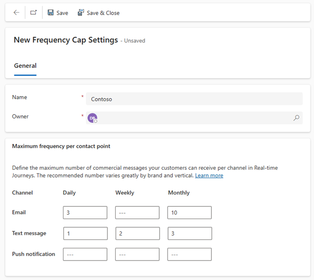

---
lab:
  title: "Labo\_4\_: créer un parcours basé sur un déclencheur"
---

## Labo 4 : créer un parcours basé sur un déclencheur 

Dans ce labo, vous allez apprendre à effectuer les opérations suivantes :
- Créer un parcours basé sur un déclencheur
- Définir des critères de sortie pour le segment 

### Tâche 1 : créer un parcours basé sur un déclencheur 
1. Accédez à la zone de travail **Parcours en temps réel**.

1. Dans **Engagement**, sélectionnez **Parcours**.

1. Dans la barre de commandes, cliquez sur **+ Nouveau parcours**.

1. Sélectionnez **Ignorer et créer entièrement**.

1. Dans **Nommer le parcours**, entrez **Parcours de bienvenue**.

1. Dans **Choisir le type de parcours**, sélectionnez **Basé sur un déclencheur**.

1. Dans **Choisir un déclencheur**, recherchez et sélectionnez **Contact Créé**.

1. Cliquez sur **Créer**.

1. Dans les paramètres du parcours à droite, dans la section Entrée, sélectionnez **Ajouter une condition**.

1. Dans le menu déroulant Attribut, sélectionnez **Contact créé > Contact (Contact) > Compte (Compte) > Nom du compte**.

1. Modifiez l’opérateur en **N’est pas égal à**.

1. Définissez la valeur sur **Humongous Insurance**. La condition doit lire **Nom du compte n’est pas égal à Humongous Insurance**.

1. Configurez le reste des éléments de la section Entrée comme suit :
    - Dans la section **Répéter**, sélectionnez Immédiatement.
    - Dans la section Fuseau horaire, choisissez votre fuseau horaire.
    - Dans Début, sélectionnez la date du jour et l’heure à 15 minutes de l’heure actuelle
    - Dans Fin, sélectionnez Demain.

### Tâche 2 : définir l’objectif du parcours
Ensuite, nous pouvons identifier l’objectif spécifique du parcours du client.  Les objectifs aident à identifier le point final du parcours.  Il peut s’agir d’éléments tels que les incitations à l’achat ou les interactions avec les clients.  Fournissez un objectif de parcours pour garantir l’arrêt du parcours une fois votre objectif atteint.    

Pour ce parcours, nous cherchons à ce qu’un pourcentage spécifique des personnes avec lesquelles nous interagissons clique sur un lien qui se trouve dans un e-mail que nous leur envoyons.  

1.  Dans les paramètres du parcours à droite, accédez à la section **Objectif**.

1.  Dans **Objectif de ce parcours**, sélectionnez **Envoyer une notification générale**.

1.  Dans le champ **L’objectif est atteint lorsque**, sélectionnez **Une personne a cliqué sur au moins un lien**.

1.  Dans **Nombre de personnes nécessaires**, entrez **50**. Laissez l’option **Pourcentage** sélectionnée. 

### Tâche 3 : définir un plafond de fréquence pour le parcours 
L’entreprise Contoso souhaite s’assurer qu’elle n’envoient pas trop de messages commerciaux à ses clients. Pour éviter que cela ne se produise, elle veut appliquer un plafond de fréquence à ce parcours.   

1.  Dans les paramètres du parcours à droite, accédez à la section **Autres paramètres**.

1.  Dans Plafond de fréquence, assurez-vous que **Appliquer un plafond de fréquence à ce parcours : ignorer les messages commerciaux si le plafond est atteint** est sélectionné.  

1.  Dans Fréquence maximale entre les parcours, sélectionnez **Accéder aux paramètres de plafond de fréquence**. Une nouvelle fenêtre s’ouvre.

1.  Sur la barre de commandes, sélectionnez **+Nouveau paramètre**.

1.  Dans le champ Nom, entrez **Contoso**.

1.  Dans la section Fréquence maximale par point de contact, configurez-la en fonction de l’image ci-dessous :

    

1. Sélectionnez **Enregistrer et fermer** pour enregistrer et fermer vos nouveaux paramètres de plafond de fréquence.  

1.  Revenez à la fenêtre qui contient votre parcours de bienvenue. **Enregistrez** le parcours et actualisez votre navigateur.

1.  À partir des paramètres de parcours à droite, accédez à nouveau à la section **Autres paramètres**.

1.  Notez que le plafond de fréquence Contoso est désormais appliquée à ce parcours.  

### Tâche 4 : créer le parcours basé sur le déclencheur 
Maintenant que nous avons défini les critères de parcours nécessaires, l’étape suivante consiste à créer les étapes réelles du parcours. 

1. Dans le concepteur de parcours, cliquez sur l’**icône plus (+)** dans la vignette Contact créé.

1. Sélectionnez **Branche d’attribut (branche basée sur une valeur spécifique)**.

1. Dans Nom d’affichage à droite, entrez **Nouveau client professionnel**.

1. Sélectionnez **Branche 1** et dans **Choisir un attribut**, recherchez **Description (description)** dans Contact.

1. Remplacez la valeur Égal à par **Contient**.

1. Dans Valeur, entrez **Entreprise**.

1. Cliquez sur l’**icône plus (+)** sous Branche 1.

1. Sélectionnez **E-mail : envoyer un e-mail**.

1. Dans **Sélectionner un e-mail**, choisissez **E-mail de bienvenue 1**.

1. Cliquez sur l’**icône plus (+)** sous la vignette Envoyer un e-mail.

1. Sélectionnez **Attendre le déclencheur**.

1. Pour configurer la branche If/then, dans le panneau de la branche If/then à droite, dans Attendre, Choisir un type de condition de branche, sélectionnez Le message précédent obtient une interaction.

1. Dans **Choisir une interaction**, sélectionnez **Lien d’e-mail cliqué**.

1. Dans **Quelle est la limite de temps ?**, entrez 10 minutes.

1. De retour dans le diagramme Parcours, pour spécifier le lien cliqué, sélectionnez **Créer des branches**.

1. Sélectionnez l’attribut **Lien d’e-mail cliqué**.

1. Dans la branche 1, sélectionnez le bouton d’appel à l’action dans l’e-mail.

1. Dans le chemin Oui, cliquez sur l’**icône plus (+)**.

1. Sélectionnez **Envoyer un message électronique**.

1. Dans Sélectionner un e-mail, choisissez **E-mail de bienvenue 2**.

1. Dans le chemin Non correspondant, cliquez sur l’**icône plus (+)**.

1. Sélectionnez **Envoyer un message électronique**.

1. Dans Sélectionner un e-mail, choisissez **E-mail de bienvenue 3**.

1. Enregistrez le parcours.

1. Passez en revue le parcours. Apportez les modifications finales.

1. Cliquez sur **Publier**. Attendez que le parcours soit publié.

